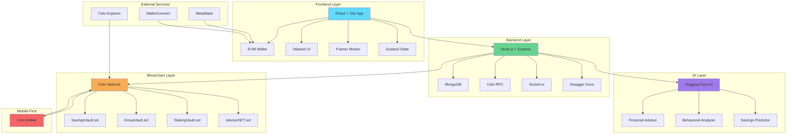
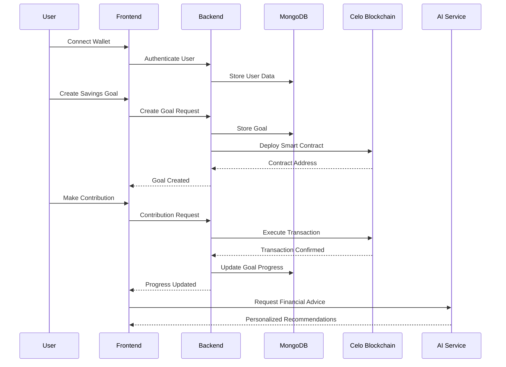
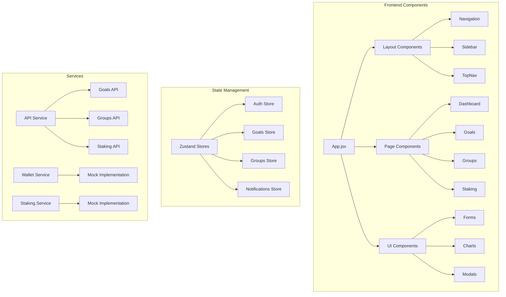
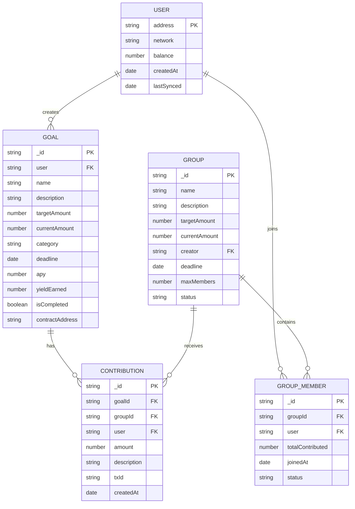
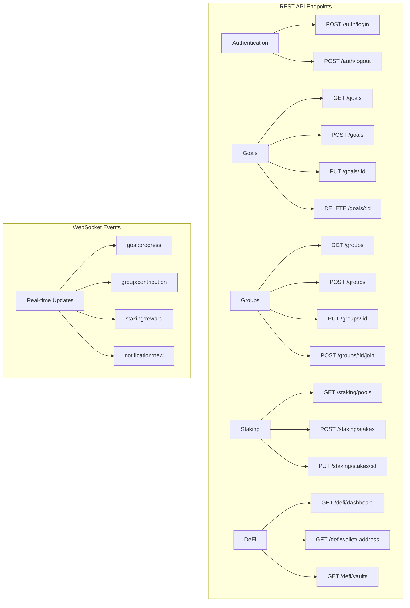
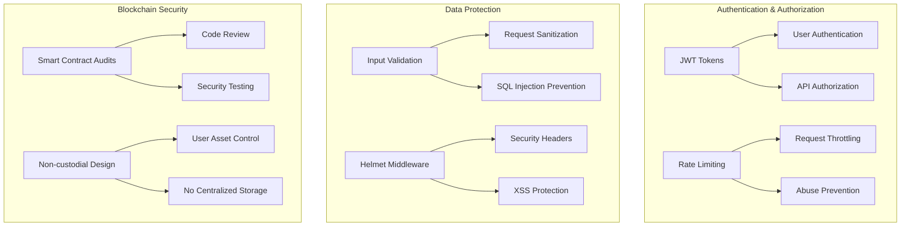
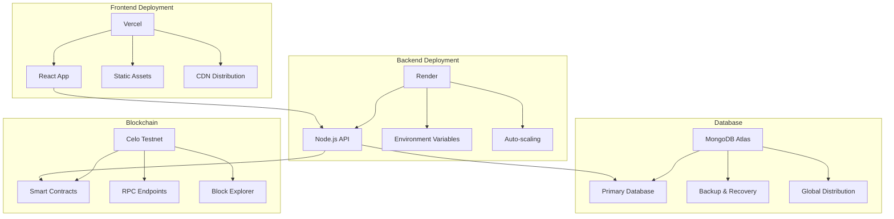
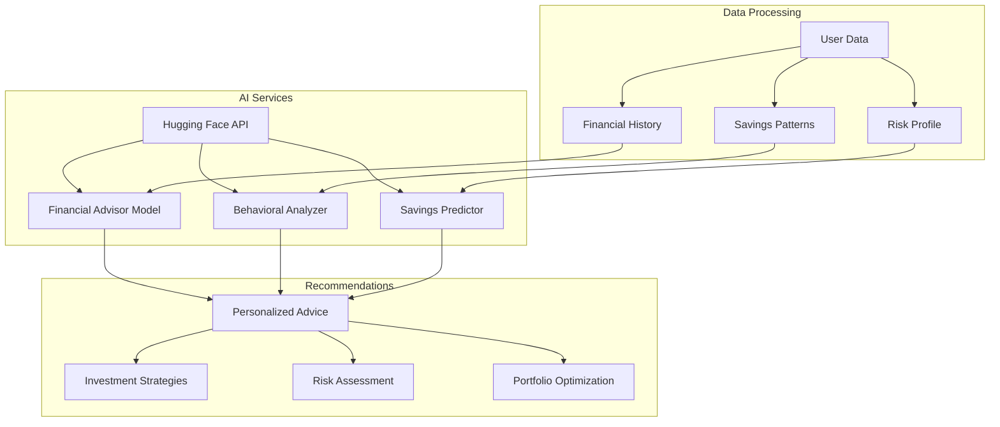
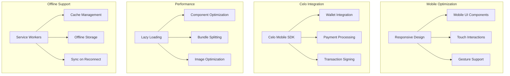
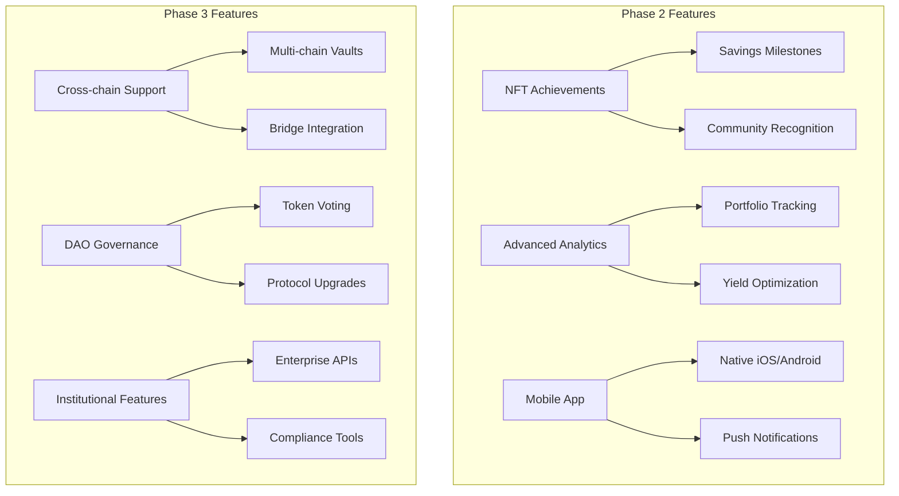

# LoopFi Architecture Diagram

This document contains the visual architecture diagram for LoopFi - AI-Powered DeFi Savings Platform on Celo.

## System Architecture Overview

## Data Flow Architecture

## Component Architecture

## Database Schema

## API Architecture

## Security Architecture

## Deployment Architecture

## AI Integration Architecture

## Mobile-First Considerations

## Future Enhancements

This architecture provides a solid foundation for building a mobile-first DeFi savings platform on Celo, with clear separation of concerns and scalable design patterns.